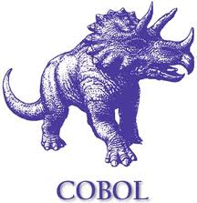

  

<h1 align="center">Olá, como vai?</h1>

 Eu sou o Levi e estudo na Fatec do Bom Retiro (Fatec-SP)

<h2 align="left"> Sobre Mim </h2>

Estudante de Análise e Desenvolvimento de Sistemas desde Jan/2025, procurando atuar como desenvolvedor Back-end ou Mainframe.  
Dedico meu tempo estudando sobre assuntos de meu interesse, mesmo que complexos como arquitetura IBM z/OS. 

Eu gosto de jogos, principalmente os difíceis (Geometry Dash).  
Adoro assistir animes e futebol (Corinthiano desde o berço).  
 

<h2 align="center"> Contatos </h2>

  
  
  
   
   

<h2 align="center"> Ferramentas </h2>

 
   

<h2 align="center"> Ferramentas (Mainframe)</h2>

  
  &nbsp;
  
  &nbsp;
  
   &nbsp;
  
  &nbsp;
   
  <h4>TSO (Time Sharing Option) ISPF (Interactive System Productivity Facility)</h4>

<h2 align="center"> Atualmente estudando</h2>
  

  

<!--
**LeviTemoteo/LeviTemoteo** is a ✨ _special_ ✨ repository because its `README.md` (this file) appears on your GitHub profile.

Here are some ideas to get you started:

- 🔭 I’m currently working on ...
- 🌱 I’m currently learning ...
- 👯 I’m looking to collaborate on ...
- 🤔 I’m looking for help with ...
- 💬 Ask me about ...
- 📫 How to reach me: ...
- 😄 Pronouns: ...
- ⚡ Fun fact: ...
-->
